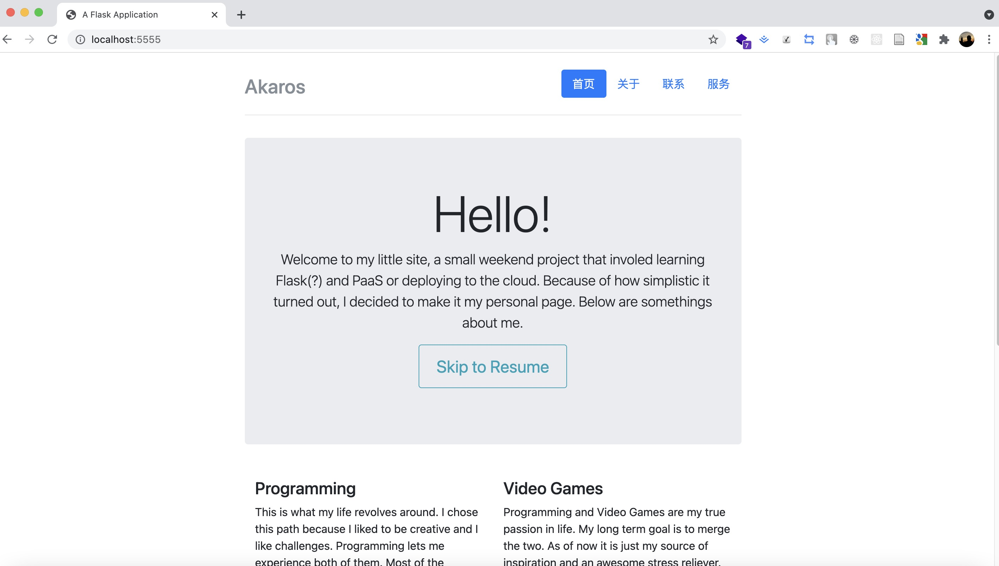

### 安装依赖
    virtualenv venv
    source venv/bin/activate
    pip install -r requirements.txt
    
### 运行
    python app.py runserver 

    # 如果要要指定端口加上 -p  便可。
    python app.py runserver -p 5000

### 效果图

截图如下
